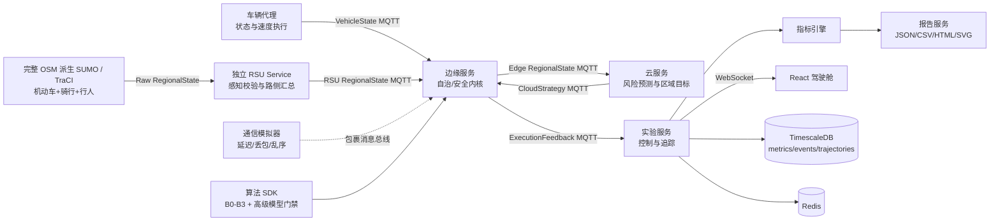
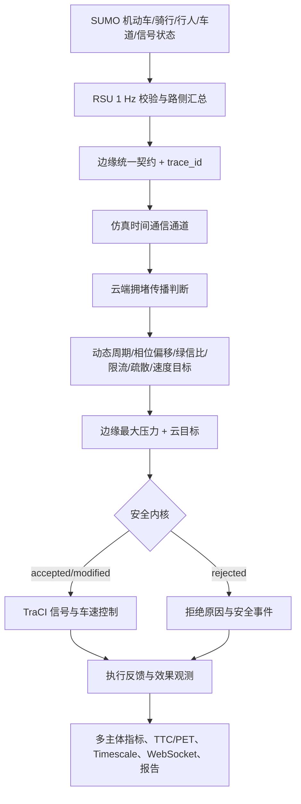
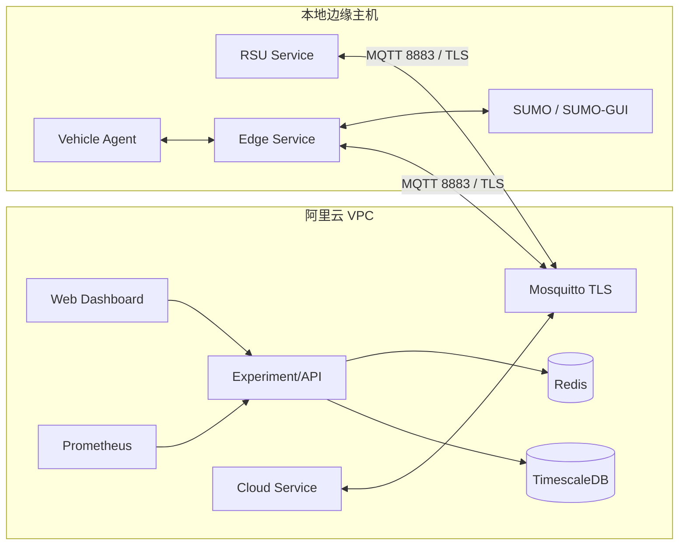
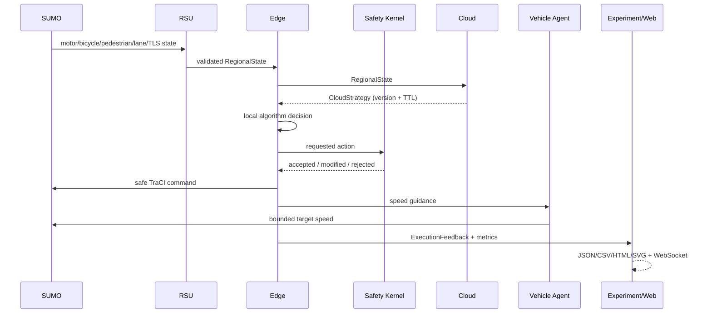
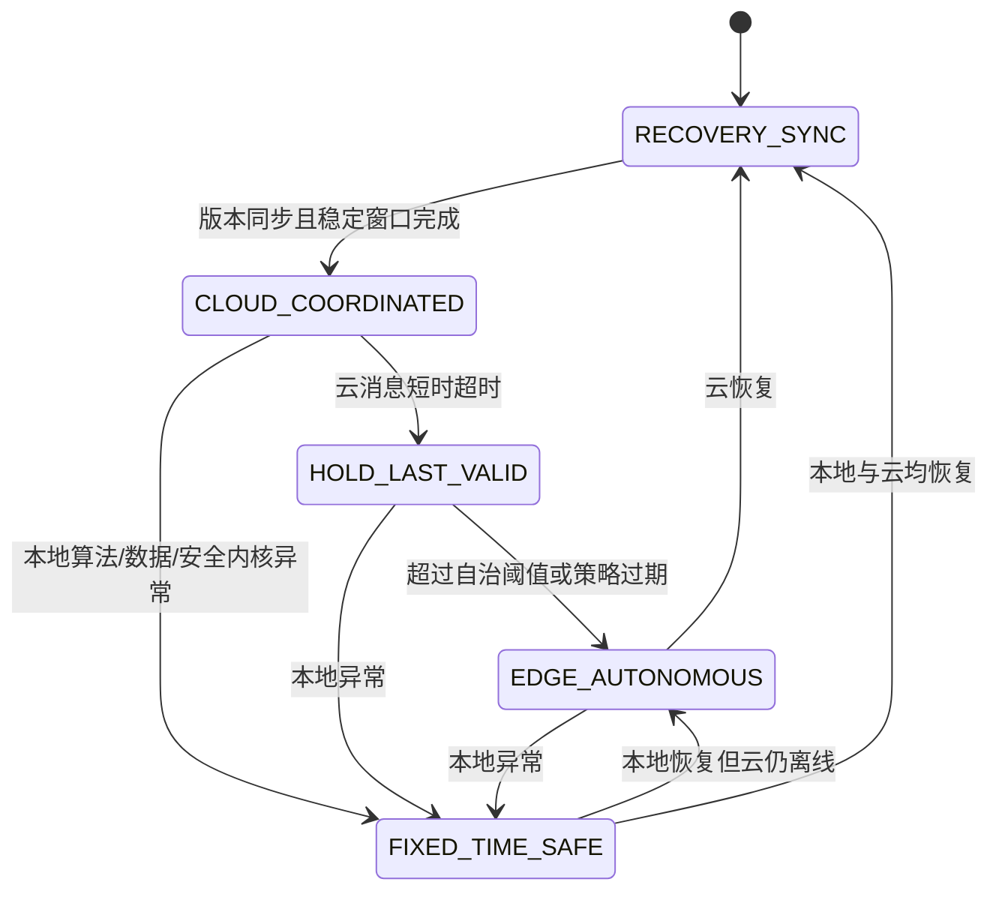

# 系统总览

## 组件图

云端只输出区域目标；任何信号动作都必须由边缘端结合本地状态并通过安全内核后执行。

## 数据流

## 部署图

## 运行时序

## 场景边界

K01—K08 与 B01—B12 是完整容东 OSM 网络中的稳定控制/观测标识，不是物理裁剪边界。车辆可使用全网边和区域 OD；仅一部分测试路线被配置为连续穿越核心走廊。多主体网络是从完整 OSM 派生的可重建文件，冻结的机动车底网保持不变。

行人信号使用“条件并行”：只有在路网确有横道且受控连接冲突可验证时，行人与兼容机动车流并行放行；否则保持既有安全相位或使用安全清空相位，不为凑数量虚构横道。

## 故障降级状态机

